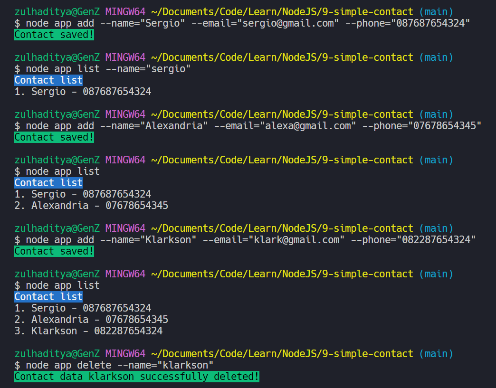

# Contacts CLI

> A command line interface based contact application created using Node.js

## Table of Contents

- [General Info](#general-information)
- [Dependencies](#dependencies)
- [Features](#features)
- [Screenshots](#screenshots)
- [Setup](#setup)
- [Usage](#usage)
- [Project Status](#project-status)
- [Contact](#contact)

## General Information

- Manage contacts.
- This app is used to store contact names, emails, and phone numbers.

## Dependencies

- chalk: version 4.1.0
- validator: version 13.5.2
- yargs: version 17.7.2

## Features

- **Add** contacts by filling the name, e-mail and phone number.
- **Delete** contacts by names.
- **Display** a list of contacts.
- **Save** contacts to JSON.

## Screenshots



## Setup

```bash
# clone this project
git clone git@github.com:Zulhaditya/contact-cli.git

# open directory
cd contact-cli/

# install the required packages
npm install
```

## Usage

```bash
# information
node app --help

# Add contact
node app add --name="Sergio" --email="example@gmail.com" --phone="067655442"

# Show contact list by names
node app list --name="Sergio"

# Delete contact by names
node app delete --name="Sergio"
```

## Project Status

Project is: _complete._ <!-- / _complete_ / _no longer being worked on_. reason ? -->

## Contact

Created by [@Zulhaditya](https://itsmyportofolio.netlify.app/) - feel free to contribute in this repository!
